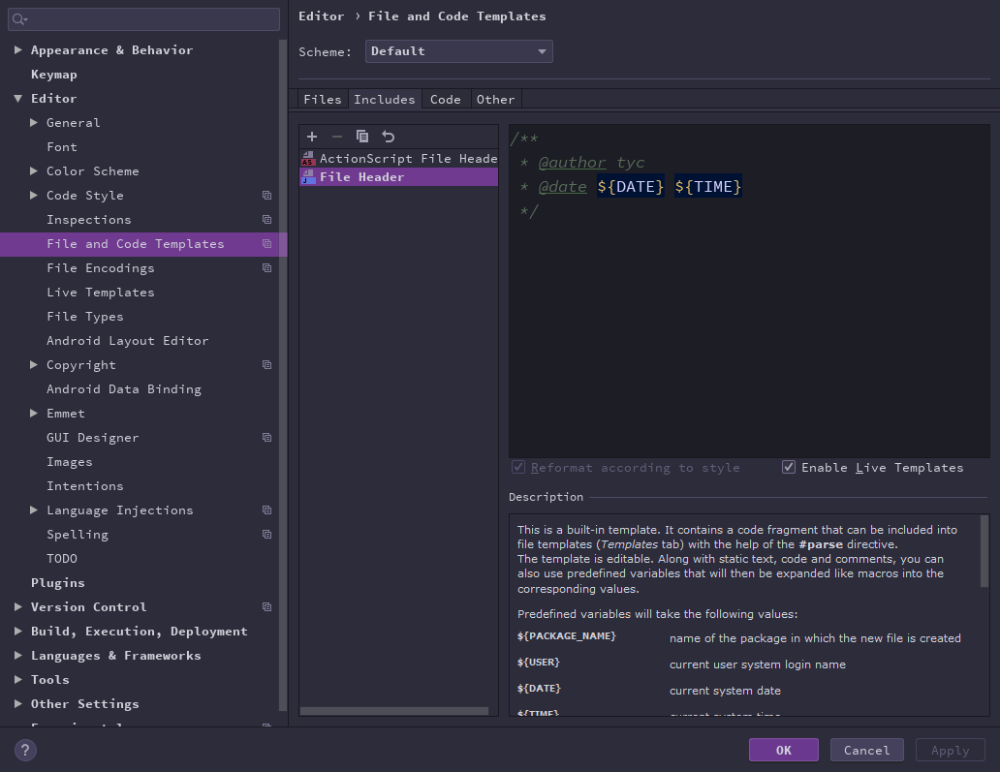
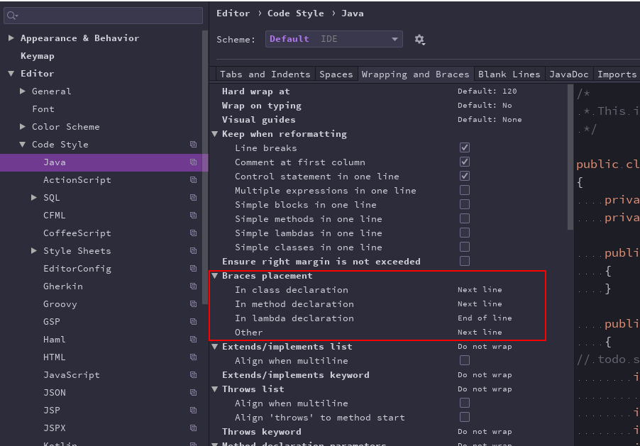

### 项目概览

>面向大学生的二手交易与悬赏拍卖平台

> version: 0.1

前台网站页面访问路径: http://localhost:9527/

后台管理页面访问路径: http://localhost:8080/

### TODO

- [x] 整合 Swagger
    文档api地址: 
    - http://localhost:9527/doc.html 
    - http://localhost:9527/doc.html


- [x] 整合mybatis-generator 和 pagehelper

- [ ] 整合 Spring Security 和 JWT


### 项目骨架

```bash
easy-trade			
  |- foreground				// 前台商城业务处理模块
  |- background  			// 后台管理业务处理模块
  |- db					   
  |   |_com.pyteam.db
  |   |            |_service
  |   |            |_dao
  |   |_resource
  |         |_com.pyteam.db.mbg.mapper      //mybatis generator生成的xml映射文件
  |         |_mapper
  |             |_foreground            //foreground模块中使用的自定义xml映射文件
  |             |_background            //background模块中使用的自定义xml映射文件
  |- commons				// 工具类
  |- search				// 搜索业务模块
```


### 后端主要技术

| 技术            | 说明                | 参考连接                                                     |
| --------------- | ------------------- | ------------------------------------------------------------ |
| Spring Boot     | Spring + Spring MVC | [Spring Boot 2.x基础教程：快速入门](http://blog.didispace.com/spring-boot-learning-21-1-1/) [Spring Boot 2.x基础教程：配置文件详解](http://blog.didispace.com/spring-boot-learning-21-1-3/) [使用Swagger2构建RESTful API](https://link.zhihu.com/?target=http%3A//blog.didispace.com/springbootswagger2/) |
| MyBatis         | ORM框架             | [Mybatis官网](http://www.mybatis.org/mybatis-3/zh/index.html) |
| Druid           | 阿里的数据库连接池  |                                                              |
| Swagger-UI      | 文档生成工具        |    https://segmentfault.com/a/1190000019273239 |
| Spring Security | 认证授权框架        |                                                              |
| JWT             | JWT登录             |                                                              |
| ElasticSearch   | 搜索功能            |                                                              |
| Lombok          |                     | https://juejin.im/post/5a6eceb8f265da3e467555fe              |


### 前端主要技术

前台: 未定
后台: vue


### 配置信息

#### MySQL

|   键      |    值        |
| -------- | ------------ |
| address  | 149.28.57.38 |
| port     | 3306         |
| username | root         |
| password | 123456       |


### IDE相关

#### 设置

**1. file header**

方便查看是谁写的代码




**2. file encoding:  utf8**

因为用户可能使用非中文与英文


3.**大括号风格**



ctrl + alt + L 格式化

 

#### 插件

- Alibaba Java Coding Guidelines  代码规范
- Free Mybatis plugin    mybatis辅助插件
- Lombok
- gitToolBox 
